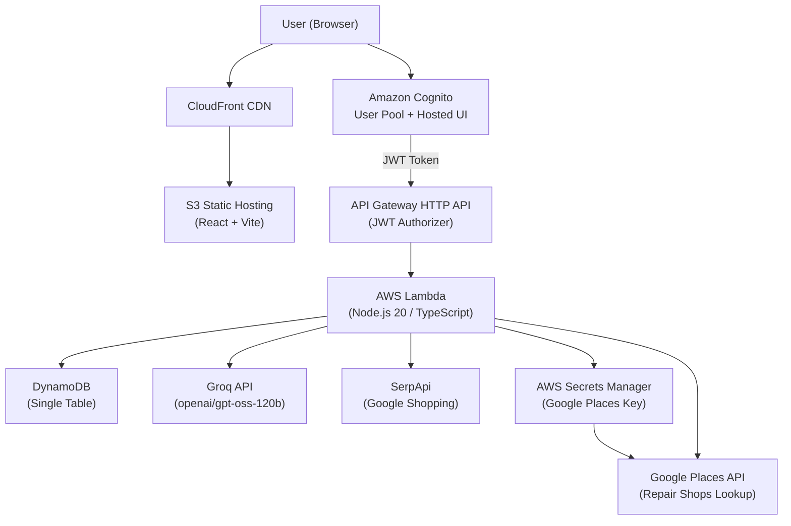
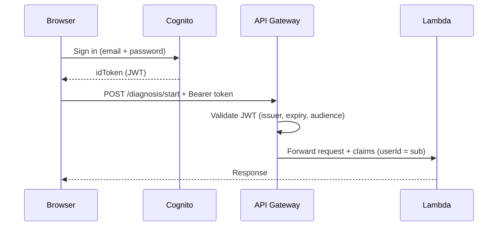
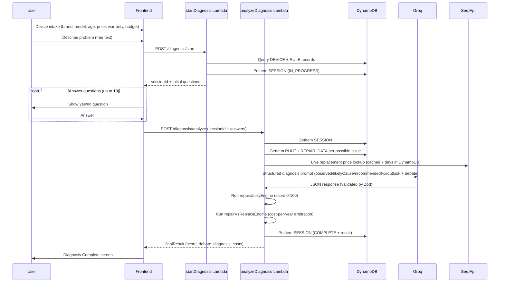
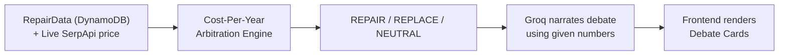
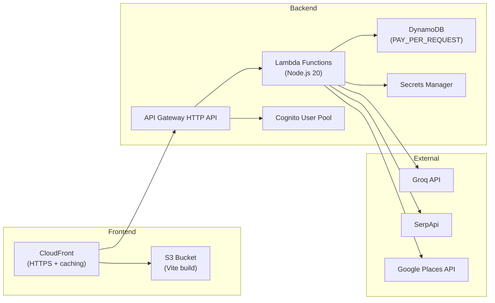

# BACK2LIFE — Architecture

> **Last updated:** September 2026 — reflects the actual deployed system, not the original planning spec.

## Overview

BACK2LIFE is a serverless AI-powered device repair advisor. Users describe a broken device, answer a short diagnostic interview, and receive a structured AI diagnosis, a repairability score, and a live cost comparison between repairing and replacing the device.

---

## High-Level Architecture

---

## Authentication Flow

Amazon Cognito User Pool with email/password sign-up and sign-in. The frontend (AWS Amplify v6) exchanges credentials for a JWT `idToken`, which is attached as a `Bearer` token on every protected API call. API Gateway validates the JWT via a built-in HTTP JWT Authorizer before forwarding to Lambda.

**Public endpoints (no auth required):** `GET /devices`, `GET /providers`

**Protected endpoints (JWT required):** all `/diagnosis/*` and `/repair-history` routes

---

## Diagnostic Flow (Full Sequence)

---

## AI Diagnosis Design

The LLM (Groq, model `openai/gpt-oss-120b`) is constrained to interpretation and narration only. It **never** invents prices, part availability, or the final recommendation — those come from deterministic backend engines.

### What the LLM does

- Interprets the pattern of yes/no answers relative to the device's symptom category
- Produces a structured 4-field diagnosis:
  - `observed` — what the symptoms indicate
  - `likelyCause` — root cause in plain language
  - `recommendedFix` — what action to take
  - `outlook` — what happens if fixed vs. not fixed
- Narrates the Repair Agent and Replace Agent arguments using **numbers it was given** (repair cost range, replacement cost range, cost-per-year figures)

### What the LLM does NOT do

- Invent prices or sourcing information
- Override the deterministic arbitration winner
- Make up parts availability ratings

### Repair vs Replace Arbitration

---

## Data Model (DynamoDB Single Table)

| Entity | PK | SK |
|---|---|---|
| Device metadata | `DEVICE#laptop` | `METADATA` |
| Diagnostic rule | `DEVICE#laptop` | `RULE#not_charging` |
| Repair data | `DEVICE#laptop` | `ISSUE#charging_port` |
| Provider (mock) | `PROVIDER#123` | `METADATA` |
| Diagnosis session | `USER#{sub}` | `SESSION#{uuid}` |
| Repair history | `USER#{sub}` | `HISTORY#{savedAt}` |
| Price cache | `PRICECACHE#{brand_model}` | `METADATA` |
| Places cache | `CACHE#PLACES` | `CITY#{city}_DEVICE#{device}` |

Sessions and history are keyed by Cognito `sub` (userId) — no anonymous sessions.

---

## Lambda Functions

| Function | Trigger | Description |
|---|---|---|
| `listDevices` | `GET /devices` | Returns device catalogue from DynamoDB |
| `getDevice` | `GET /devices/{id}` | Returns single device + symptoms |
| `startDiagnosis` | `POST /diagnosis/start` | Creates session, matches diagnostic rule, returns initial questions |
| `analyzeDiagnosis` | `POST /diagnosis/analyze` | Full AI pipeline: SerpApi pricing → Groq diagnosis → score engines → result |
| `getDiagnosis` | `GET /diagnosis/{id}` | Returns completed session result |
| `listProviders` | `GET /providers` | Google Places API lookup (with DynamoDB cache + mock fallback) |
| `saveRepairHistory` | `POST /repair-history` | Persists completed session to user history |
| `listRepairHistory` | `GET /repair-history` | Returns all history items for authenticated user |

---

## Repairability Score Engine

Computed deterministically from real data — no LLM involvement:

| Sub-score | Input |
|---|---|
| Parts Availability (30%) | `GOOD` / `MEDIUM` / `POOR` from RepairData |
| Repair Complexity (20%) | `LOW` / `MEDIUM` / `HIGH` from RepairData |
| Cost Ratio (25%) | `repairCost / replacementCost` |
| Age Factor (15%) | Device age vs expected lifespan (from intake date) |
| Usability (10%) | `expectedRemainingUsabilityYears` from RepairData |

Penalties: prior repair history reduces the score by 10% (1 prior repair) or 20% (2+ repairs).

---

## External Integrations

| Service | Purpose | Fallback |
|---|---|---|
| **Groq** (`openai/gpt-oss-120b`) | AI structured diagnosis + debate narration | Structured fallback response with real cost data |
| **SerpApi** (Google Shopping) | Live replacement pricing (INR) | Category average from RepairData |
| **Google Places API** | Real local repair shops (Text Search) | Seeded mock providers with `(Demo)` label |
| **AWS Secrets Manager** | Stores Google Places API key securely | — |

---

## Deployment Architecture

All infrastructure is managed via **AWS CDK** (`infra/cdk/`). Stacks:
- `Back2LifeAuthStack-dev` — Cognito User Pool + App Client
- `Back2LifeDataStack-dev` — DynamoDB table
- `Back2LifeApiStack-dev` — API Gateway + all Lambda functions + IAM roles
- `Back2LifeFrontendStack-dev` — S3 bucket + CloudFront distribution
- `Back2LifeMonitoringStack-dev` — CloudWatch alarms + dashboard

---

## Environment Variables (Lambda, set via CDK)

| Variable | Source | Description |
|---|---|---|
| `GROQ_API_KEY` | `infra/.env` | Groq API key |
| `GROQ_MODEL_ID` | `infra/.env` | Model ID (e.g. `openai/gpt-oss-120b`) |
| `SERPAPI_KEY` | `infra/.env` | SerpApi key for live pricing |
| `TABLE_NAME` | CDK auto-injected | DynamoDB table name |
| `USER_POOL_ID` | CDK auto-injected | Cognito User Pool ID |

**Google Places API key** is NOT an env var — it is read at runtime from AWS Secrets Manager (`back2life/places-api-key`) by the `listProviders` Lambda.
