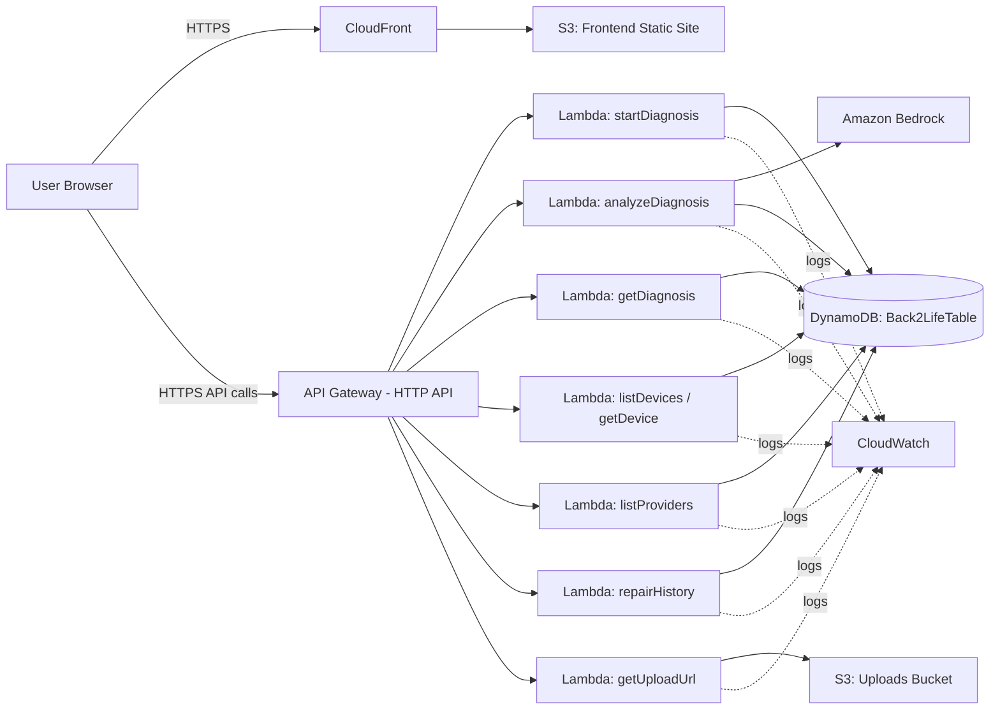
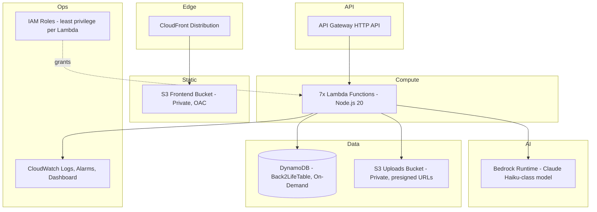
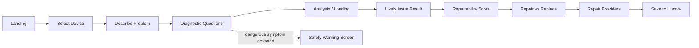
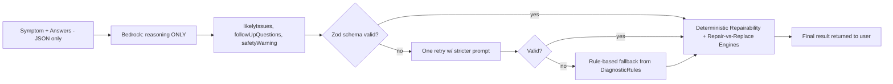
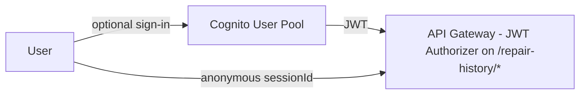
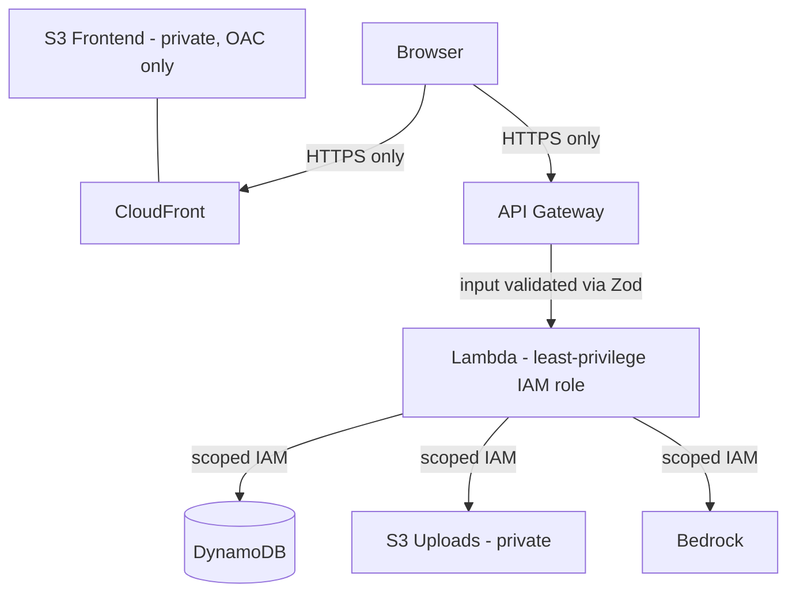

# architecture.md — BACK2LIFE

## 1. High-Level Architecture



## 2. Component Architecture

- **Frontend (SPA):** React app, ten screens, calls the API through a single typed client module.
- **API layer:** API Gateway HTTP API — single entry point, CORS enabled for the CloudFront domain only.
- **Compute layer:** One Lambda per route, sharing a common Lambda Layer (`lib/`) for DynamoDB access, the Repairability Engine, the Repair-vs-Replace Engine, Zod schemas, and response helpers.
- **AI layer:** Bedrock invoked from exactly one Lambda (`analyzeDiagnosis`). All other Lambdas never call Bedrock.
- **Data layer:** DynamoDB single table; S3 for static assets and optional uploads.
- **Cross-cutting:** IAM roles scoped per Lambda; CloudWatch for logs/alarms.

## 3. AWS Architecture (deployment view)



## 4. Frontend Flow



## 5. Backend / Diagnostic Flow

```mermaid
sequenceDiagram
    participant FE as Frontend
    participant API as API Gateway
    participant L1 as startDiagnosis Lambda
    participant L2 as analyzeDiagnosis Lambda
    participant BR as Bedrock
    participant DB as DynamoDB

    FE->>API: POST /diagnosis/start {device, problemText}
    API->>L1: invoke
    L1->>DB: fetch DiagnosticRules for device
    L1->>DB: create DiagnosisSession (status=IN_PROGRESS)
    L1-->>FE: {sessionId, questions[]}
    FE->>API: POST /diagnosis/analyze {sessionId, answers}
    API->>L2: invoke
    L2->>L2: check answers for dangerous-symptom flags
    alt dangerous symptom present
        L2-->>FE: {safetyWarning: true, message}
    else safe
        L2->>BR: invoke with {device, problemText, answers}
        BR-->>L2: structured JSON {likelyIssues, followUpQuestions, safetyWarning}
        L2->>L2: validate AI output (Zod); reject/fallback if invalid
        L2->>DB: fetch RepairData for matched issue(s)
        L2->>L2: run Repairability Engine (deterministic)
        L2->>L2: run Repair-vs-Replace Engine (deterministic)
        L2->>DB: update DiagnosisSession (status=COMPLETE, result)
        L2-->>FE: {likelyIssue, score, comparison}
    end
```

## 6. AI Flow (Bedrock boundary)



The AI never touches the score, never touches pricing, and never generates provider data — those always come from `RepairData`/`Providers` tables or the deterministic engines.

## 7. Database Flow

Lambdas read `Devices` and `DiagnosticRules` to build the question set, read `RepairData` to price the matched issue, write `DiagnosisSessions` to persist session state, and write `RepairHistory` when the user opts to save a result. `Providers` are queried independently by device category/city for the provider screen. See `schema.md` for keys and indexes.

## 8. S3 Flow

Frontend build artifacts are synced to the frontend bucket and served via CloudFront. Photo uploads (P2) go directly from the browser to S3 using a presigned PUT URL issued by `getUploadUrl` — the Lambda never proxies file bytes, keeping cost and Lambda duration minimal.

## 9. Repair Provider Flow

`listProviders` Lambda queries `Providers` by device category (and optionally city, via GSI1). Provider data is 100% mock/demo, clearly labeled in the UI as "Demo Providers."

## 10. Authentication Flow (P2)



MVP ships without this — anonymous `sessionId` only.

## 11. Error Flow

Every Lambda wraps its handler in a try/catch that maps known failure modes to the standard error envelope (see `schema.md` and `Rules.md`) and logs full details to CloudWatch only — never returns internals to the client.

## 12. Security Flow



## 13. Deployment Architecture

CDK (TypeScript) stack per environment. `dev` and `demo` stacks deploy identical infrastructure with different resource name suffixes. Frontend deploy is a separate script (`build` → `s3 sync` → `cloudfront invalidate`) so frontend iteration doesn't require a full infra redeploy.

## 14. AWS Services Used — Rationale

| Service                | Why it's used                                             | Essential for MVP?                   |
| ---------------------- | --------------------------------------------------------- | ------------------------------------ |
| S3 (frontend)          | Cheapest static hosting; pairs with CloudFront            | Essential                            |
| CloudFront             | HTTPS + caching for the SPA                               | Essential                            |
| API Gateway (HTTP API) | Managed, cheap, HTTPS entry point to Lambda               | Essential                            |
| Lambda                 | Serverless compute, pay-per-use, no idle cost             | Essential                            |
| DynamoDB               | Serverless, on-demand pricing, fits known access patterns | Essential                            |
| Bedrock                | Only AI component; used narrowly for symptom reasoning    | Essential                            |
| CloudWatch             | Logs + cost/error alarms                                  | Essential                            |
| IAM                    | Required for any AWS resource access                      | Essential                            |
| S3 (uploads)           | Presigned-URL photo upload                                | Optional (P2)                        |
| Cognito                | Optional login for cross-device history                   | Optional (P2)                        |
| Amplify Hosting        | Alternative to S3+CloudFront if Git-based CI/CD preferred | Optional                             |
| Bedrock Guardrails     | Extra layer against prompt injection / unsafe output      | Optional, recommended if time allows |

Explicitly **not used** and why: EC2/ECS/EKS (no always-on compute needed), RDS (access patterns don't need relational joins), NAT Gateway/complex VPC (Lambdas don't need outbound internet beyond AWS APIs, which are reachable without a VPC), ElastiCache (no caching need at this scale), OpenSearch (no full-text search requirement).
